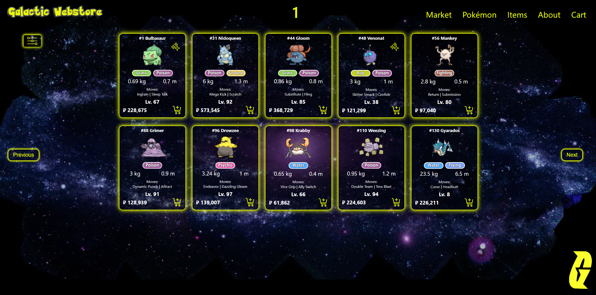
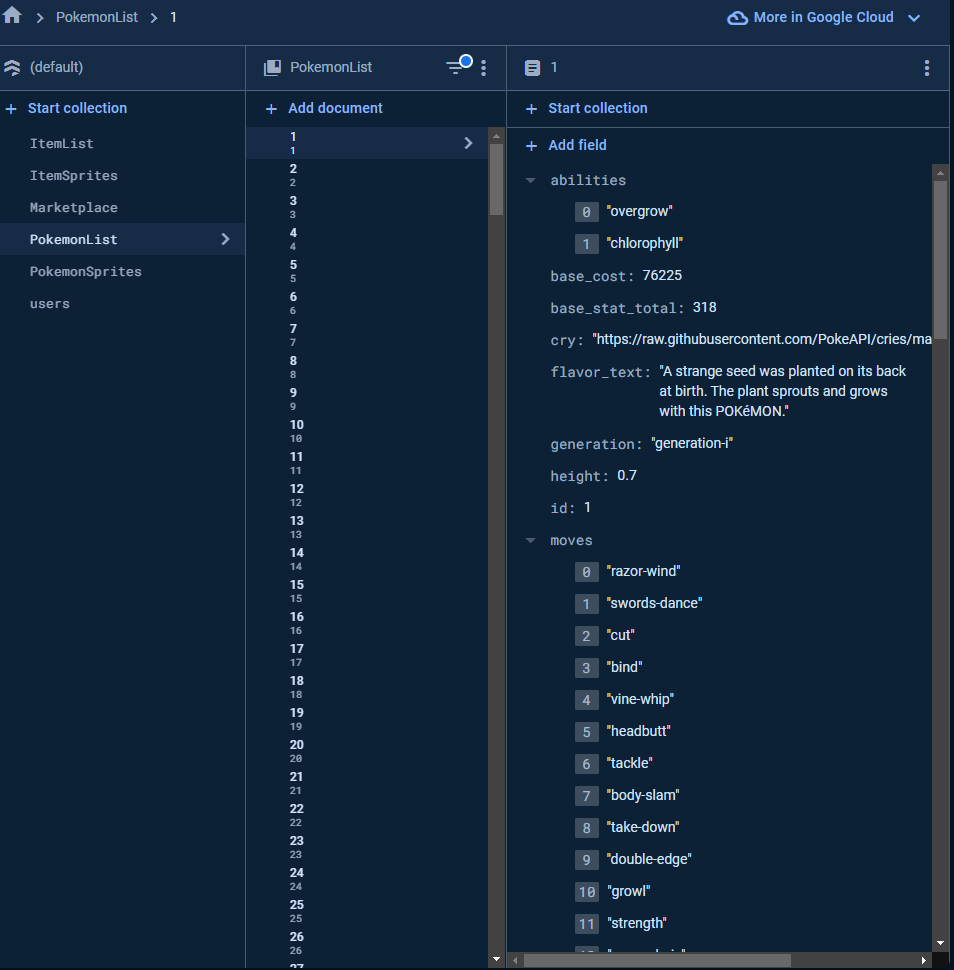
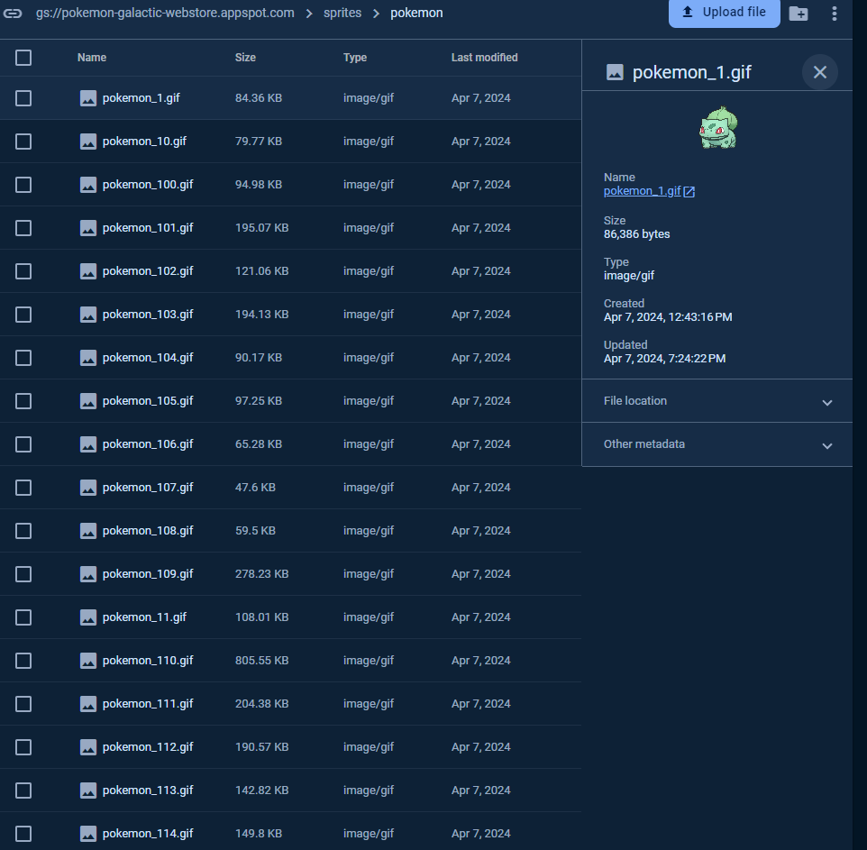
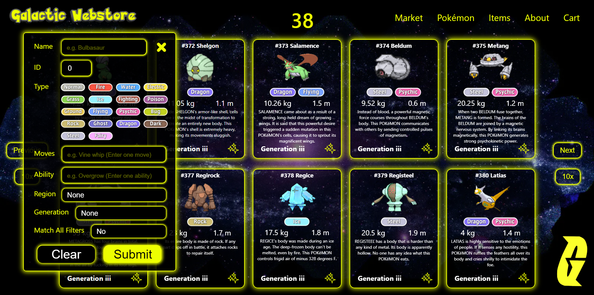

# Pokemon_Galactic_WebStore

## https://galacticwebstore.com/



# About 
This is a web application that we build in 10 working days for our Hacksprint to show off some backend skills. Our theme was "Galatic Marketplace" that was given to everyone. We decided to take a spin off this with Pokemon!

The web page that allows users to purchase pokemon and items from a marketplace. This also allows users to view different pokemon from generations from 1-8. 

Pokemon can be viewed that shows there available moves to learn, base stats, abilities, region, name, typing, height, weight, pokedex id, default/shiny .gif, cry, and pokedex text entry.

The marketplace is on a 24 hour cycle and auto assigns pokemon level, shiny chance, and cost(based off an algorithm) to a page where users can purchase these pokemon with pokedollars. The users sign up and receive 100,000 pokedollars to use on the marketplace. Then are allotted another 25,000 pokedollars every 24 hours after this when logged in. The users can view the pokemon they have bought on there profile page.

# Versions 1.0 Features
- User Authentication
- Client side Pagination
- Some unit tests
- Api Documentation
- Marketplace that is on a 6 hour cycle
- User Profile page
- Pokemon Page
- Cart Page
- About Page

## Future Goals
- Add more tests
- Add Selling to the marketplace
- Add more items
- Allow evolution of pokemon once bought

# Installation and Setup 
This project was built using the following technologies:
- JavaScript, Node.js, CSS, Express, React, Firebase, VSCode, GitHub, Vite

- [](https://skillicons.dev)

## Install Node.js
- Download the installer from the official website: https://nodejs.org/en/download/
We used Node version 20.10.0 for this project.

## Install NVM (Node Version Manager)
- Download the installer from GitHub: https://github.com/nvm-sh/nvm
- Follow the installation instructions on the GitHub page.

## Clone the Repository
```
git clone https://github.com/Shadi-Shwiyat/Pokemon_Galactic_WebStore
```
- Use nvm to switch to the project's Node.js version:
```
nvm use
```
- Install project dependencies that are listed in the package.json file:
```
npm install
```

# Setup database 
## Firebase
- Create a new project in Firebase and Firestore. You can do this by going to the Firebase Console and clicking on the "Add Project" button. You will need to give your project a name and then click "Create Project". Once your project is created, you will be taken to the project dashboard. Click on the "Firestore Database" tab in the left-hand menu and then click on the "Create Database" button. You will be asked to choose a location for your database. Choose a location that is closest to your users for the best performance. Once you have chosen a location, click "Next" and then click "Done". Your Firestore database is now created.

### Helpful Firebase Commands
- To deploy the project to Firebase, run the following command:
Firebase deploy
- To deploy only functions to Firebase, run the following command:
Firebase deploy --only functions
- To deploy only one function to Firebase, run the following command:
Firebase deploy --only functions:functionName
- To deploy only database to Firebase, run the following command:
Firebase deploy --only database
- To deploy only hosting to Firebase, run the following command:
Firebase deploy --only hosting




## Set Up the Database for Firestore and Storage:
We are using Firestore database compared to Realtime Database from firebase due to the cost of bandwidth and storage. Firestore database is more scalable and flexible compared to Realtime Database. Firestore is a NoSQL document database that simplifies storing, syncing, and querying data for our web and mobile applications at scale. It's a flexible, scalable database for mobile, web, and server development from Firebase and Google Cloud Platform.

First you need to create a new project in Firebase and Firestore. You can do this by going to the Firebase Console and clicking on the "Add Project" button. You will need to give your project a name and then click "Create Project". Once your project is created, you will be taken to the project dashboard. Click on the "Firestore Database" tab in the left-hand menu and then click on the "Create Database" button. You will be asked to choose a location for your database. Choose a location that is closest to your users for the best performance. Once you have chosen a location, click "Next" and then click "Done". Your Firestore database is now created.

To execute some of the script you need to have credentials for the service account. You can generate a new private key file for your service account by going to the Firebase Console and clicking on the "Project Settings" button. In the "Service Accounts" tab, click on the "Generate New Private Key" button. This will download a JSON file with your service account credentials. You will need to save this file to your project directory and rename it to "serviceAccountKey.json" which I renamed "credentials.json" and is where all the secret keys live and is hidden.



# Running the Application 
- To run the application front end which is React, run the following command:
-Npm start (for local development)
-Npm run build (for production)

- To run the application back end which is firebase functions, run the following command:
-Firebase serve (for local development)
-Firebase deploy (for production)

- To host the application on Firebase, run the following command:
-Firebase deploy (which deploys frontend and backend)
This is all setup in the firebase.json where you need to configure the hosting and functions.

# API Documentation 
All API requests should be made to: `https://pokemon-galactic-webstore.web.app`

API Endpoint documentation can be found in the `Design_Documentation/API` directory.
As well as Postman tests for each endpoint.
The API documentation includes information about the request and response format for each endpoint, as well as the expected status codes.

# UI Design Documentation 
The UI design documentation can be found in the `Design_Documentation/UI` directory.
We utilized Figma to design the UI for the web application.



### Troubleshooting
If you encounter any issues with the API, please refer to the troubleshooting section in the API documentation.
There are also Postman tests for each endpoint that can be used to verify that the API is working correctly.

Also let us know if you have any issues and we can help you out.

# Testing 
- We used Jest for testing the API endpoints functionality.
- To run the tests, run the following command:
npm test 
We need to build more test but we have a few to show how we can test the API endpoints.

# Resources  
- Pokemon Sprites from https://projectpokemon.org/home/docs/spriteindex_148/
- Pokemon Cry from https://pokemoncries.com/
- Pokemon Data from https://pokeapi.co/

# Contributors 

<div style="display: flex; justify-content: space-around;">
    <div>
        
        <p>Rob Farley</p>
        <a href="https://github.com/Nomad-Rob">Github</a> - <a href="https://www.linkedin.com/in/robertfarley89/">Linkedin</a>
    </div>
    <div>
        
        <p>Shadi Shwiyat</p>
        <a href="https://github.com/Shadi-Shwiyat">Github</a> - <a href="https://www.linkedin.com/in/shadi-the-programmer/">Linkedin</a>
    </div>
</div>


